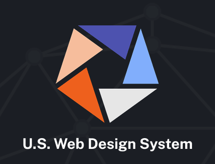

  <section class="row-0" aria-label="Page title">
    
AMY_LEADEM/ README.md

  </section>

  <section aria-label="hero">
    <h1 class="font-size-3xl">{{page.headline}}</h1>
  </section>

  <section aria-label="personal summary">
    

      Senior front-end developer specializing in design systems and accessibility
    

  </section>

  <section aria-label="key projects and resume">
    <h2>Experience highlights</h2>
    <article class="job-card job-card--one-item">
      
      

        
2021-2025

        <h3 class="job-card__headline">Senior developer on the U.S. Web Design System core team</h3>
        
USWDS is the open source design system for the federal government that makes it easier to build accessible, mobile-friendly government websites.

        
See my merged contributions on GitHub:

        <ul>
          <li>
            <a href="https://github.com/uswds/uswds/pulls?q=is%3Apr+is%3Amerged+author%3Aamyleadem">
              USWDS component library contributions
            </a>
          </li>
          <li>
            <a href="https://github.com/uswds/uswds-site/pulls?q=is%3Apr+is%3Amerged+author%3Aamyleadem">
              USWDS documentation website contributions
            </a>
          </li>
        </ul>
      

    </article>
    <article class="job-card job-card--two-items">
      

        
2019-2021

        <h3>Led design and development of Fortune 50 design systems</h3>
      

      

        

          <h4 class="job-card__subheadline">Created Raytheon Technologies' intranet design system</h4>
          
Served as project lead and primary front-end developer for the redesign of Raytheon’s intranet system reaching 60,000 end users daily. 

          
This new design was developed to streamline hundreds of one-off designs into a single system reflecting the new company brand. 

        

        

          <h4 class="job-card__subheadline">Created a design system for Raytheon's public-facing websites</h4>
          
Lead front-end developer for a new design system and component library to be shared across multiple public-facing websites.

          
Developed a front-end code base from the ground up. Replaced a layered, cluttered code base with one that was lean and future-friendly.

        

      

    </article>
    

      <a class="button" href="./resume">Download resume</a>
    

  </section>

  <section class="practice-area" aria-label="breaking down silos">
    

      <h2 class="font-size-2xl">Connecting practice areas</h2>
      
All web project work eventually finds its way into code. Bringing technical knowledge to conversations with content, accessibility, and UX/UI teams reduces friction as work moves through the project. 

    

    

      <ul>
        <li>
          Accessibility
          
        </li>
        <li>
          Content
           
        </li>
        <li>
          Development
          
        </li>
        <li>
          UX/UI
        </li>
      </ul>
    

  </section>

  <footer>
    <ul>
      <li>LinkedIn</li>
      <li>Github</li>
    </ul>
  </footer>

